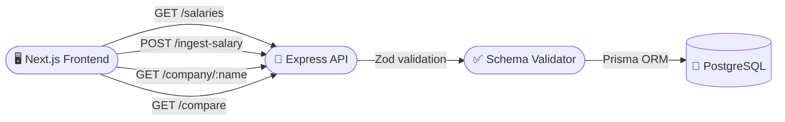

# 💰 TalentDash — Salary Transparency for Indian Tech

> **Stop guessing. See real base, bonus, and stock breakdowns — structured by L3/L4/L5 levels.**

This is a compensation intelligence platform inspired by [levels.fyi](https://levels.fyi), built to show what engineers at top tech companies make.

---

## 🔗 Live Demo

**[talentdash-live.vercel.app](https://talentdash-live.vercel.app)**

> ⚠️ This is a demo project built for an assessment. The data is seeded and submissions are stored in a real PostgreSQL database, but the app is not intended for production use.

---

## 🏗️ Architecture



---

## ✨ What Makes It Interesting

- **Level-normalized** — all salaries mapped to standardized L3/L4/L5 levels so you can compare across companies fairly
- **TC breakdown** — every entry shows a visual base/bonus/stock split, not just a total number
- **Company intelligence** — per-company pages with median TC, avg comp by level, and level distribution charts
- **Side-by-side comparison** — pick any two salaries and see a full breakdown diff with a winner banner
- **Anonymous submissions** — anyone can contribute a salary via the submit form, hits the real API

---

## ⚙️ Features

| Feature | Details |
|---|---|
| 📊 Salary database | Filter by company, role, level, location — sorted by TC |
| 🏢 Company pages | Median TC, top earner, avg by level, level distribution chart |
| ⇌ Offer comparison | Side-by-side base/bonus/stock/TC breakdown with diff |
| 📝 Submit salary | Anonymous form — validates via Zod, normalizes company name |
| 📈 TC breakdown strip | Visual bar showing base/bonus/stock proportion per entry |
| 🏆 Company leaderboard | Ranked by avg TC with relative bar chart |
| 🔍 Live filters | Company, role, level, location — updates instantly |
| 💡 Level quick-filter | One-click L3/L4/L5 filter pills above the table |

---

## 🗂️ Project Structure

```
comp-engine/
├── frontend/                    # Next.js 16 + Tailwind CSS v4
│   └── app/
│       ├── page.tsx             # Home — salary table + charts + leaderboard
│       ├── company/[name]/      # Company detail page
│       ├── compare/             # Side-by-side offer comparison
│       ├── submit/              # Anonymous salary submission form
│       └── layout.tsx           # Nav + metadata
│
└── backend/                     # Node.js + Express + Prisma
    ├── src/
    │   ├── index.ts             # Express server entry
    │   ├── routes.ts            # All API route handlers
    │   └── validators.ts        # Zod schema validation
    └── prisma/
        └── schema.prisma        # PostgreSQL data model
```

---

## 🔌 API

```
POST /ingest-salary      Validate schema, normalize company name, compute total TC
GET  /salaries           Server-side filtering by company, role, level, location
GET  /company/:company   Salary list, median TC, level distribution
GET  /compare            Side-by-side breakdown — base, bonus, stock, total, level
```

---

## 🚀 Stack

- **Frontend** — Next.js 16, Tailwind CSS v4, TypeScript
- **Backend** — Node.js, Express, Prisma ORM
- **Database** — PostgreSQL
- **Validation** — Zod
- **Deployment** — Vercel (frontend) + Railway (backend)
